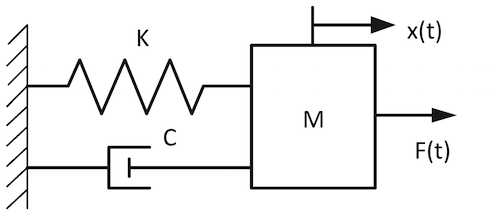
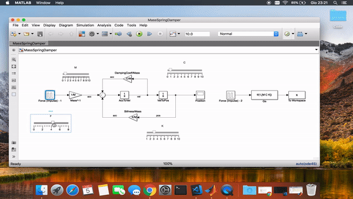

# Mass-Spring-Damper
### A MATLAB animation for ideal mass-spring-damper system with mass M, spring constant K and damping coefficient C.

The mass-spring-damper is the typical car suspension model. The wheel, having a proper mass, is attached to the car body with a damped spring. Many real-world systems can be modelled by the mass-spring-damper system. 

## GIF-demo

## Something more

The mass spring damper summarizes the structure of a typical dynamical systems. The use of mass spring damper representation allow to translate physical equation into proper differential equation that once implemented (or solved) determine the proper temporal evolution of the corresponding system. 

The design of the process dynamics starts from the low level physical equations. Coming to the Mass-Spring-Damper example, one can write:

Where, which can be easily be implemented with the following schematic diagram:

Given the fact that mass-spring-damper is one of the simpler dynamical model, often is explained in High school / University's courses but, many times, it is not simpler to imagine the model at work. So I decided to implement a simple animation for MATLAB/Simulink. Please note the difference between modeling the system and designing a proper controller for a given system. This is a simple animation for the model of the system and not the controller.

### How-to
Nothing more simple, download the src folder, add it to your MATLAB workspace and open the simulink model. With slider you can freely choose the value for constants, and change the simulation time. Press PLAY and wait for the animation to begin.

### License, Cite & Use
Feel free to use, include somewhere, re-distribute code (in the limit of MIT license). If you use in your book, article, lesson please include my name in credit.
